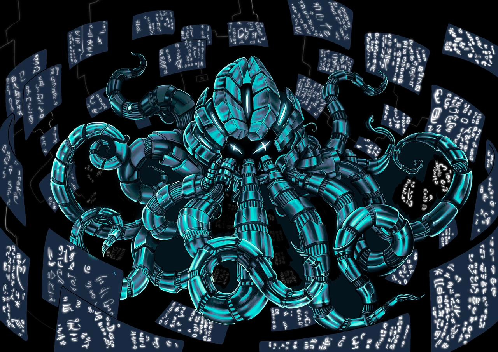

<div align="center">

</div>

# Starknet Stack

`````mermaid
flowchart LR
	A("Client") ==>|"Starknet Transactions"| Sequencer
	Sequencer -.->|"Blocks with txs"| watcher-prover["Watcher prover"]
	watcher-prover ==>|"Request blocks through RPC "| Sequencer
	watcher-prover ==>|"STARK proofs"| Db[("Proof Storage")]
	style Db stroke-dasharray: 5
	subgraph watcher-prover["Watcher prover"]
		cairo-vm("Cairo VM") ==>|"trace"| prover("Lambdaworks Prover")
	end
	subgraph Sequencer
		C("Consensus") ==x|"tx settlement"| B("Cairo Native")
		B -.->|"tx execution info"| C
	end
    Sequencer ===>|"Blockchain data"| Explorer("Web explorer + verifier")
    Db <-.-> |"Verifiable proofs"| Explorer
    
`````

## Descripción general

El Stack de Starknet es un conjunto de tecnologías para lanzar y operar blockchains de validación descentralizadas de alto rendimiento basadas en Starknet y Cairo. Abarca todo el ciclo: secuenciación de transacciones de usuarios en bloques, su ejecución y generación de pruebas de validez para resolver transiciones de estado, manteniendo alta capacidad de procesamiento y transparencia.

El ciclo consta de dos componentes principales:

- [Sequencer](/sequencer): La parte de secuenciación escrita en Rust, que incluye la liquidación y ejecución de transacciones de usuarios mediante [Cairo Native](https://github.com/lambdaclass/cairo_native).
- [Watcher-Prover](/watcher_prover): Un servicio independiente que se encarga de solicitar bloques con transacciones a los nodos secuenciadores para obtener las transacciones y generar trazas con [Cairo VM](https://github.com/lambdaclass/cairo-vm/), que luego son comprobadas por nuestro [Lambdaworks Starknet Prover](https://github.com/lambdaclass/starknet_stack_prover_lambdaworks). Las pruebas se almacenan para que los usuarios puedan consultarlas según sea necesario.

Puedes encontrar más información sobre cada componente en sus respectivos subdirectorios.

Además, también puedes explorar la blockchain con [Starknet Stack Explorer](https://github.com/lambdaclass/starknet_stack_explorer).

## Inicio rápido

Para ejecutar localmente a través de Docker, sigue estos pasos:

```
make run-local
```

Esto desplegará 4 nodos de consenso, el watcher-prover y el blockchain explorer. Antes de finalizar, se ejecutará un cliente que enviará varias transacciones. Los nodos de consenso implementan la RPC de Starknet (parcialmente por ahora), por lo que puedes utilizar curl para acceder a los puntos finales adecuadamente. También puedes acceder al explorador Madara en http://localhost:4000/ y revisar la blockchain.

Cuando hayas terminado, no olvides detener los contenedores con `make stop`.

### Envío de transacciones

Como se mencionó anteriormente, como parte de `make run-local`, se ejecutará un cliente que enviará transacciones aleatorias al secuenciador para poblar la blockchain. También puedes ejecutar el cliente cuando lo desees (`make run-client`).

### Flujo

- El cliente envía transacciones aleatorias de invocación (ejecución de Fibonacci o factorial) a los nodos de consenso, que las ejecutan con Cairo Native.
- Los nodos de consenso votan y comprometen bloques según corresponda. Si no se envían transacciones, se crean bloques vacíos de manera regular.
- Paralelamente, el watcher-prover consulta los puntos finales de la RPC y verifica las transacciones en los bloques.
- Cuando el watcher-prover obtiene un nuevo bloque o transacción, demuestra la ejecución a través del CairoVM y el prover LambdaWorks.
- Las pruebas se guardan en el sistema de archivos o en S3 (por defecto, el sistema de archivos).
- En el explorador, puedes navegar por los bloques y ver las transacciones que incluyen, junto con el estado de su prueba:
   - El campo `Local verification` indica si la prueba está disponible y si ha sido verificada en el explorador. Si, después de esperar unos segundos, el campo muestra "Verified", significa que el explorador ha recuperado la prueba y ha sido verificada. Si muestra "Pending", significa que el watcher-prover aún no ha hecho disponible la prueba.

## Supuestos de confianza

- Actualmente no hay forma de validar si una prueba de ejecución está relacionada con una transacción específica. Esto está previsto para el futuro.
- El hecho de que el pool de provers solicite bloques/transacciones del secuenciador implica que debe haber confianza entre ellos, por lo que se alienta a ejecutar un nodo de confianza junto con el pool de provers. Alternativamente, debido a que utilizamos un consenso BFT, el usuario también podría consultar a 2/3 de los nodos para validar el consenso (aunque esto tiene sus propios inconvenientes).

## Funcionalidades faltantes
- Soporte para ERC-20 utilizando Starknet en Rust con Cairo Native.
- Una prueba por bloque que incluya todas las transacciones.
- Inclusión de funciones incorporadas faltantes para el Stark Prover.
- Soporte para cuentas.
- Demostrar StarknetOS.
- Tokens nativos para Proof of Stake.
- Soporte para múltiples algoritmos de consenso.
- Agregar soporte para programas generalizados (actualmente, solo se ejecutan programas de Fibonacci/factorial).
